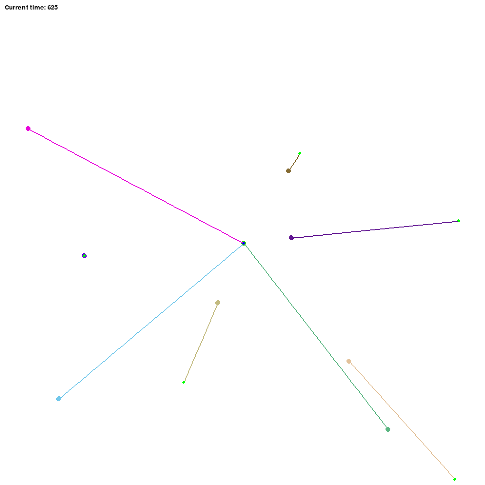
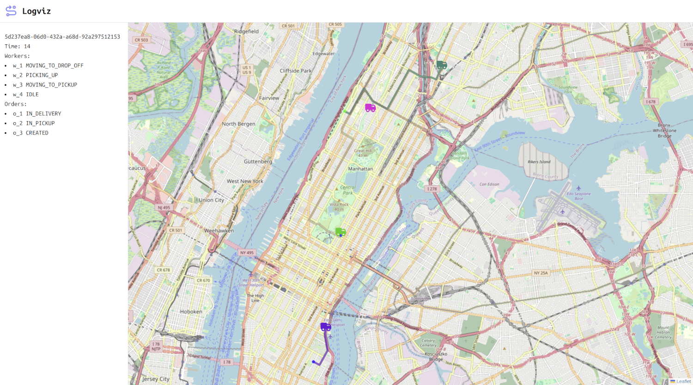

# Logistics Envs

Gym environments for logistics tasks that can be described as "Move something from A to B"

## Environments

Each environment can be used in two modes:

- `CARTESIAN` - locations are constrained to be on a unit square lat ∈ [0.0, 1.0], lon ∈ [0.0, 1.0]. This mode uses straight-line routing and L2 distances
- `GEOGRAPHIC` - locations are considered to be valid coordinates lat ∈ [-90.0, 90.0], lon ∈ [-180.0, 180.0]. This mode uses real routes from Openstreetmap. Please, check the **Geographic mode** section below for more information

### Q Commerce Environment

Environment that models Q-commerce services



### Ride-hailing Environment

Environment that models Ride-hailing services



## How to install

```bash
pip install git+https://github.com/Sarrasor/logistics_envs.git@main
```

### Geographic mode

Geographic mode uses Valhalla or OSRM routing engines to create routes for workers. One can create local Valhalla/OSRM server with Docker

- Valhalla is recommended for dynamic maps and different types of workers
- OSRM is recommended for static maps and large time/distance matrices

Make sure to set `PBF_FILE` and `DOWNLOAD_LINK` in the `Makefile` to your geographic region

#### Valhalla

```bash
make download_valhalla_graph
make start_valhalla
```

It will take some time on the first launch, you can check whether it is up by going to `http://localhost:8002/status`

Once the container is ready, you can check whether everything is ok by going to:

`http://localhost:8002/route?json={"locations":[{"lat": 40.7824, "lon": -73.9557},{"lat": 40.8211, "lon": -73.9547}],"costing":"auto"}`

In addition, you may want to modify `service_limits` in `valhalla_files/valhalla.json` to increase the maximum allowed time/distance matrix size. For example:

```json
"service_limits": {
    "auto": {
      "max_distance": 500000,
      "max_locations": 1000,
      "max_matrix_distance": 500000,
      "max_matrix_location_pairs": 1000000
    },
    ...
}
```

Restart the the server for changes to be applied:

```bash
make restart_routing
```

#### OSRM

OSRM has two algorithms:

- Multi-Level Dijkstra (MLD)
- Contraction Hierarchies (CH)

The latter is recommended for large distance matrices

```bash
make download_osrm_graph
make extract_osrm

# For CH algorithm
make contract_osrm

# For MLD algorithm
make partition_osrm
make customize_osrm

# CH algorithm is set by default
make start_osrm
```

Once the container is up and running, you can check whether everything is ok with:

```bash
curl "http://localhost:5000/route/v1/car/-73.9557,40.7824;-73.9547,40.8211"
```

### Visualization in geographic mode

You can use [Logviz](https://github.com/Sarrasor/logistics_envs_visualizer)